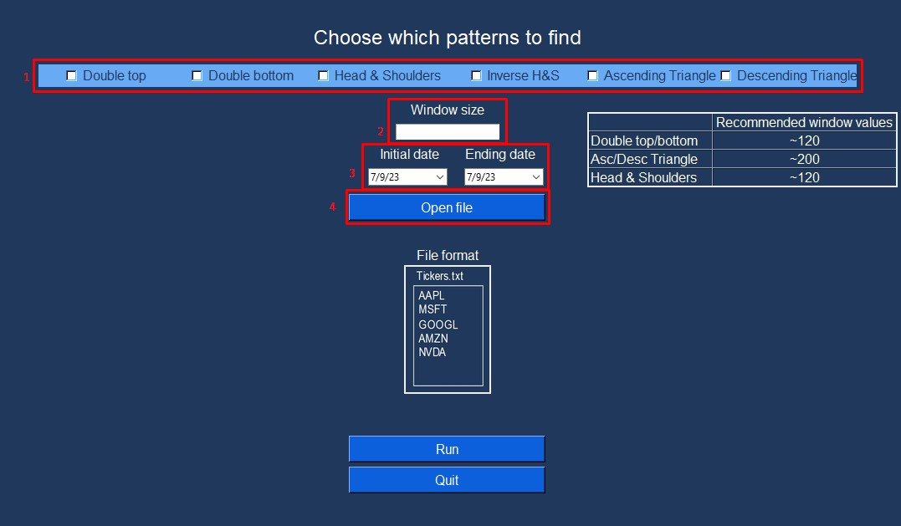

# PerseumAI

> Aitor Alonso Melián
> Trabajo de fin de Grado para la Universidad de La Laguna  
> 14/07/2023

## ¿Que es PerseumAI?
PerseumAI es una herramienta cuyo objetivo es identificar patrones chartistas en bolsa para el conjunto de empresas que el usuario proporcione.

Actualmente es capaz de identificar los siguientes patrones:
- Doble suelo
- Doble techo
- Hombro cabeza hombro
- Hombro cabeza hombro invertido
- Triangulo ascendente
- Triangulo Descendente

## Instalación
Hay dos maneras de ejecutar el programa. 
#### Ejecutable Windows
Si desea ejecutar el programa mediante un ejecutable de Windows, puede descargarlo del siguiente **[enlace](https://drive.google.com/file/d/1HttBz1FRj8d0pMoaUGFGgnolzLUdVWx-/view?usp=sharing)**. Una vez descargado el archivo, se extrae mediante WinRar, y dentro de la carpeta se ejecuta el archivo '**PerseumAI.exe'**.

#### Clonar el repositorio
Se puede clonar el repositorio a través del siguiente comando:
```git clone https://github.com/AitorAlonsoMelian/PerseumAI.git```

Una vez clonado el repositorio, para ejecutar el programa hay que ejecutar el archivo [PerseumAI](./source/PerseumAI.py) mediante Python. La versión de Python utilizada para el desarrollo ha sido la versión 3.9.2.

Para ejecutar el archivo con Python se ejecuta el siguiente comando (estando ubicado en la carpeta raiz del proyecto):
```python3 source/PerseumAI.py```

## Manual de uso
Es necesario proporcionarle al programa los siguientes parámetros:
1. Los patrones que se desean encontrar
2. El tamaño de ventana para buscar estos patrones.
3. La fecha de inicio y fin en la cual tiene que buscar esos patrones.
4. El conjunto de empresas (o empresa) en el cual se desea buscar estos patrones.



1. Los patrones a encontrar se pueden seleccionar simplemente usando los checkbox.

2. El tamaño de ventana se tiene que proporcionar en el campo de texto del punto 2. El tamaño de ventana es el tamaño en el que se dividirán los datos internamente para buscar patrones. Este programa trabaja con los datos de cierre diarios. Por ejemplo si se quiere analizar 'Microsoft' desde el 2010 hasta el 2020, habrá una cantidad de 365 * 10 = 3650 datos. El tamaño de ventana determinará cuantos datos se seleccionan para tratar de encontrar patrones. Si no se entiende mucho este concepto, siempre se pueden seleccionar los valores recomendados en la tabla de la derecha. 
3. La fecha se selecciona bien escribiendola manualmente, o bien haciendo click en la flecha para que aparezca un calendario y poder seleccionar la fecha en el calendario.
4. El archivo que contiene el conjunto de empresas, separados por saltos de línea, de los tickers de las empresas a analizar. En el repositorio hay varios archivos de ejemplo como por ejemplo [Sector Financiero](./sector_financiero.txt). Solo pueden ser empresas registradas en al bolsa estadounidense, ya que la API utilizada 'yfinance' solo permite descargar datos de empresas estadounidenses.

**ADVERTENCIA**: Esta herramienta tiene como único objetivo servir de ayuda para aquellas operaciones bursátiles que desee realizar. Cualquier daño o pérdida causada por esta herramienta no es responsabilidad de la herramienta en sí, ni del equipo de desarrollo.


**WARNING**: This tool has the sole purpose of serving as an aid for those stock market operations that you wish to carry out. Any damage or loss caused by this tool does not fall under the responsability of the tool itself, nor of the development team.
